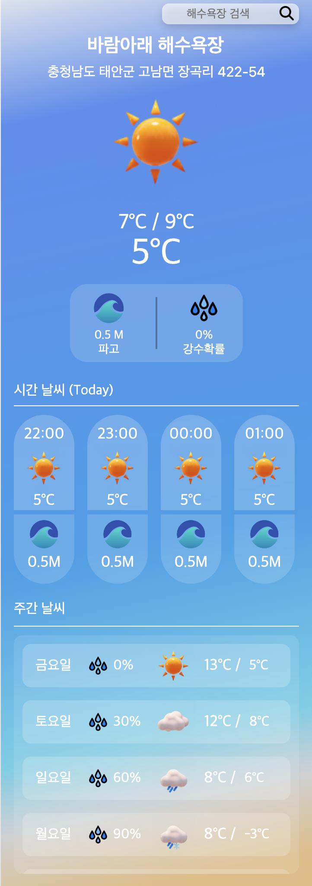
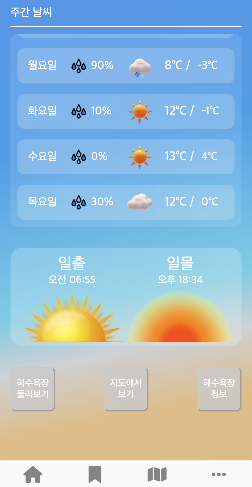
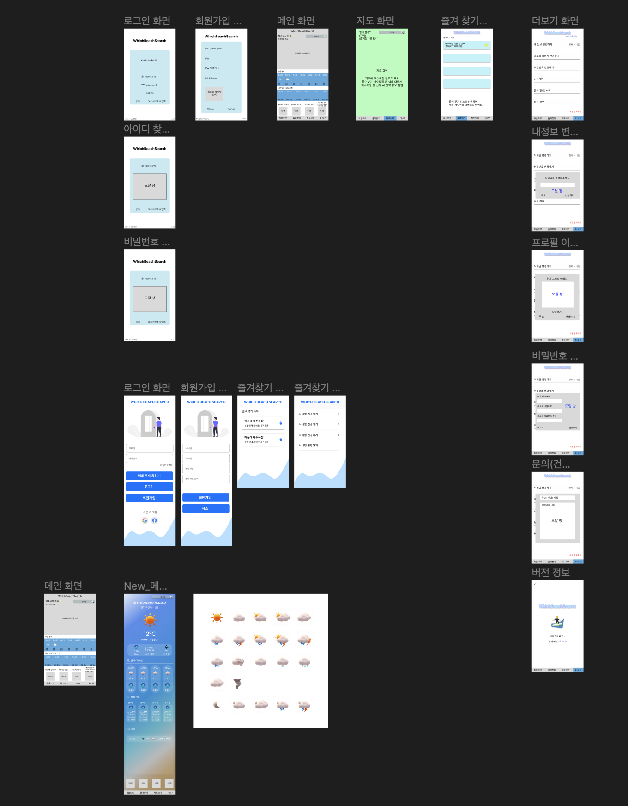
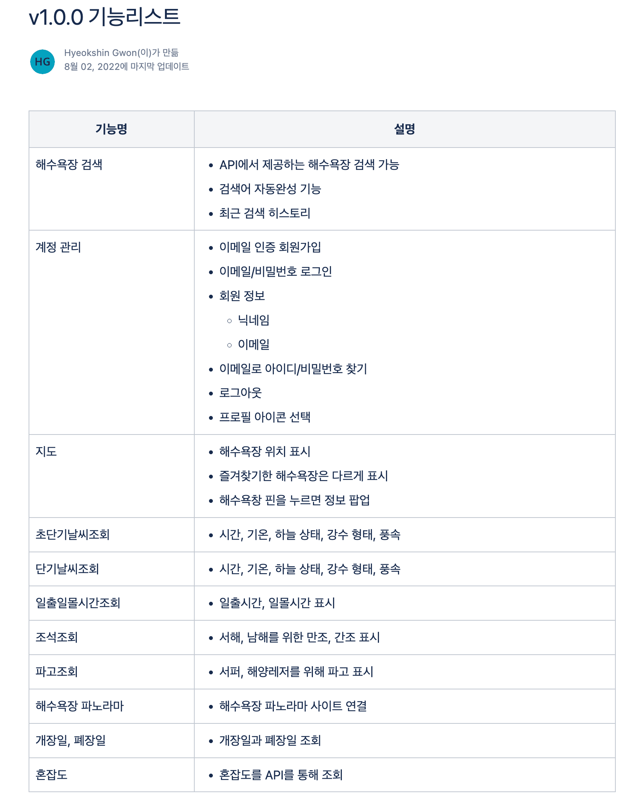
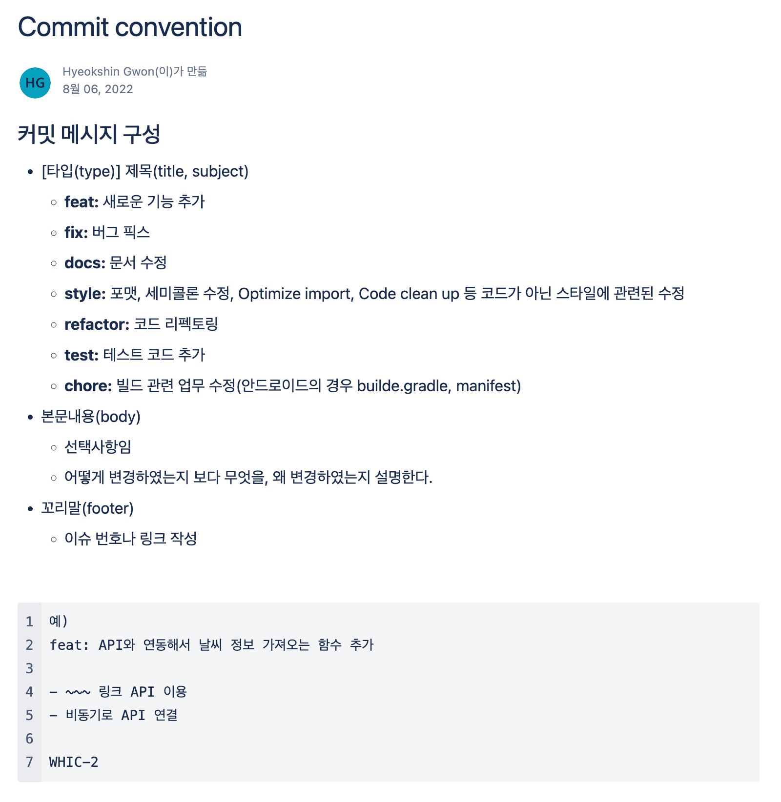
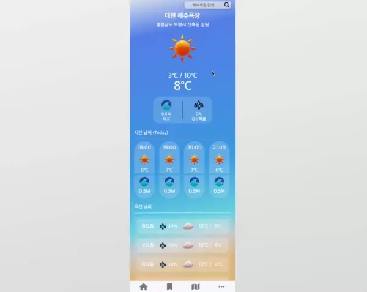
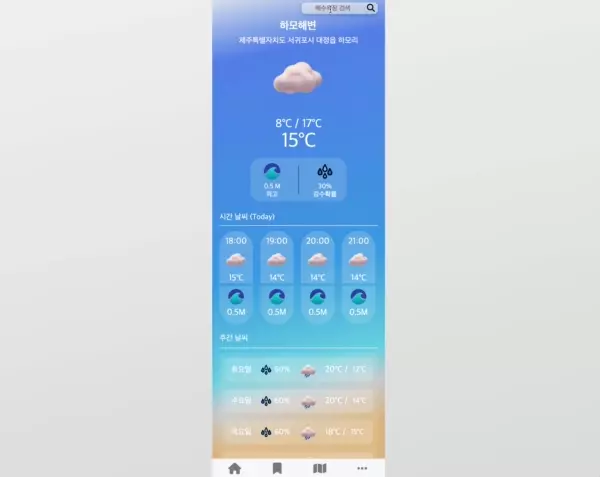
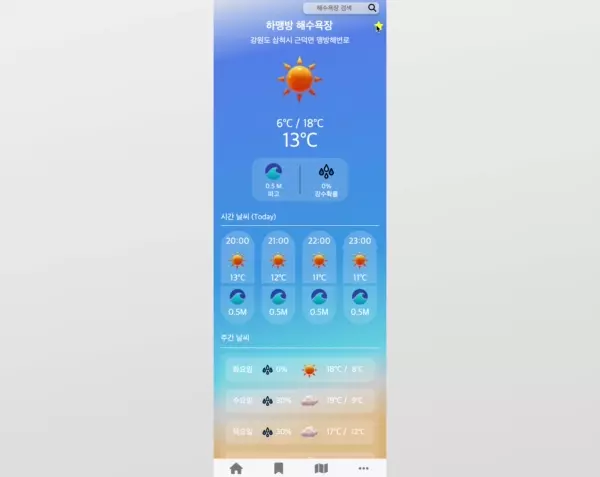
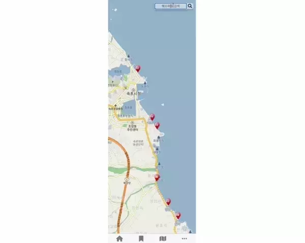
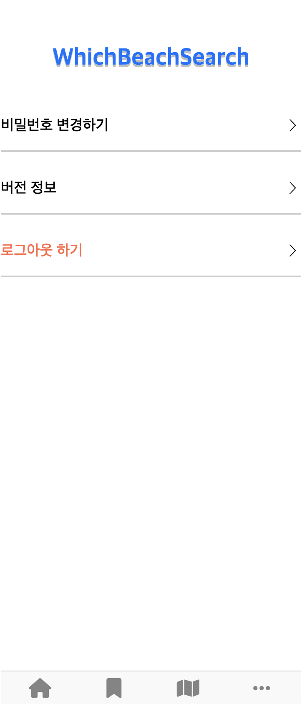

# WHICH BEACH SEARCH

## 🏖 국내 해수욕장 정보 조회 서비스

<br/>
<p align="center">


</p>  
<br/>

## 프로젝트 개요

---

- #### 휴가철에는 유명한 해수욕장의 몰려드는 인파의 문제, 해상 스포츠를 즐기는 사람에겐 파고와 같은 해상 날씨의 정보가 중요합니다.
- #### 사람도 몰리지 않고, 나는 몰랐던 숨은 보물 같은 해수욕장을 찾고 계신가요? <br/>해상 스포츠를 즐기기위해 해수욕장의 날씨와 해상 정보를 쉽고 빠르게 알고 싶으신가요?
- #### 이러한 불편함을 해결하고자 전국 모든 해수욕장에 대한 정보와 날씨, 해상 정보를 제공하는 서비스를 개발하기로 하였습니다.
<br/>

## 프로젝트 설계

---

### **Figma 🖌**

#### 1. 화면 와이어프레임 작성

#### 2. 실제 서비스 화면 디자인 적용

<br>
<p align="center">

</p>

<br/>
<br/>

### **v1.0.0 기능 리스트 정리**

<br>
<p align="center">

</p>

### **개발 환경 정의**

Code Convention & Commit Convention 설정 및 정의

<br>
<p align="center">


</p>

<br>

### **디렉토리 구조**

```
💾 root
┣ 📂 assets
┣ 📂 js
┣ 📂 css
┣ 📂 components
┗ 📂 pages
  ┣ 📂 bookmark
  ┣ 📂 join
  ┣ 📂 lignin 
  ┣ 📂 main
  ┣ 📂 map
  ┗ 📂 mypage
```

폴더|내용
|:--:|:--:|
assets| 로고, 아이콘 assets 파일들
js| firebase 초기화, 에러 처리, 로딩화면 구현 파일
css| 공통 스타일링 정의 파일
components| 재사용성이 있는 UI 스타일링 정의 파일 
pages | 각 화면들의 구현 코드가 있는 폴더<br>각 화면의 폴더에는 html, js, css 파일이 있음

<br>
<br>

## **Tech Stack 🛠**

---

<br>

|                                       HTML5                                       |                                      CSS                                       |                                      JavaScript                                      |                                         Firebase                                         |
| :-------------------------------------------------------------------------------: | :----------------------------------------------------------------------------: | :----------------------------------------------------------------------------------: | :--------------------------------------------------------------------------------------: |
| <br> | <br> | <br> | <br> |

<br>

|                                           GitHub                                           |                                           GitHub-Desktop                                            |                                        GitFlow                                         |
| :----------------------------------------------------------------------------------------: | :-------------------------------------------------------------------------------------------------: | :------------------------------------------------------------------------------------: |
| <br> | <br> | <br> |

<br>

|                                       Jira                                       |                                          Confluence                                          |
| :------------------------------------------------------------------------------: | :------------------------------------------------------------------------------------------: |
| <br> | <br> |

<br>
<br>

## 기능 구현 화면

---

### 1. 회원가입 화면

- 이메일 & 비밀번호 회원 가입
- 비밀번호와 비밀번호 확인 값 데이터 일치해야 가입 진행
- 이메일 형식과 비밀번호에 대한 데이터 유효성 검증
<p align="center">
 
 </p>

<br>

### 2. 로그인 화면

- 서비스에 대해 회원가입 하지 않고, 먼저 사용해보시길 원하는 분들을 위한 비회원으로 로그인 기능
- 이메일 & 비밀번호 로그인 또는 구글, 페이스북 소셜로그인 방식
- 비밀번호 찾기 기능
<p align="center">
 
 </p>

<br>

### 3.1 메인 화면

- 해당 해수욕장의 12시간 날씨 및 주간 날씨 제공
- 해당 해수욕장의 오늘 일출, 일몰 시간 정보
- 해수욕장 둘러보기 (3D 파노라마 뷰 사이트로 이동)
- 해수욕장 정보 (해수욕장 정보가 있는 사이트로 이동)
- 지도에서 보기 (해수욕장 위치 지도상에서 표시)
<p align="center">
   
   </p>

<br>

### 3.2 메인화면 - 검색

- 검색 자동 완성 기능 구현
<p align="center">
   
   </p>

<br>

### 4. 북마크 화면

- 해수욕장 즐겨찾기 기능
- 즐겨찾기에서 해수욕장 클릭 시 해수욕장 메인 화면으로 이동
- 비회원의 경우 북마크 화면 진입 시 로그인 여부 확인
<p align="center">
   
   </p>

<br>

### 5. 지도 화면

- 해수욕장 검색 기능
- 지도에 해수욕장 위치에 마커 표시
- 마커 선택 후 상세보기 클릭 시 메인 화면으로 이동
<p align="center">
   
   </p>

<br>

### 6. 더보기 화면
- 비밀번호 변경 기능
- 로그아웃 기능
<p align="center">
   
   </p>

<br>
<br>

## 배운 점 및 아쉬운 점
---
<br>

### 배운 점
- 서버리스 환경에서의 데이터 관리
- 비동기 처리와 에러처리
    + await, async 적절한 사용 방법 등
    + 에러처리 방법 (catch)
- Firebase 회원가입 및 로그인 구현 방법과 데이터 유효성 검증
- 많은 API 호출로 인하여 로드 시간이 길어지는 부분에 대한 대처
    + 로딩 화면을 보여줌으로써 현재 페이지가 로드중인 것을 표시
- 공공기관 또는 카카오 지도와 같은 API 호출 방법과 사용 방법
    + XML만 지원하는 데이터는 JSON 데이터로 변환하여 사용

### 아쉬운 점
* main.js 하나의 파일에 main 화면의 모든 비즈니스와 UI 로직이 담겨있음
    + 리팩토링 시 이 부분을 비즈니스 로직과 UI 로직을 분리해주어야 함.. 
* 모바일 사이즈로만 제작 되어있음
    + 모바일 겸 웹 서비스로 제작하기 위해 모바일 사이즈로 먼저 제작함
    + 반응형으로 웹까지 적용하려 했지만 프로젝트 일정과 맞지 않아 구현되지 못하였음
* Map 화면에서의 검색 자동 완성 기능 미구현
    + 메인 화면 작업 후 최우선 작업들을 먼저 작업하다보니 일정이 초과되어 구현되지 못함.