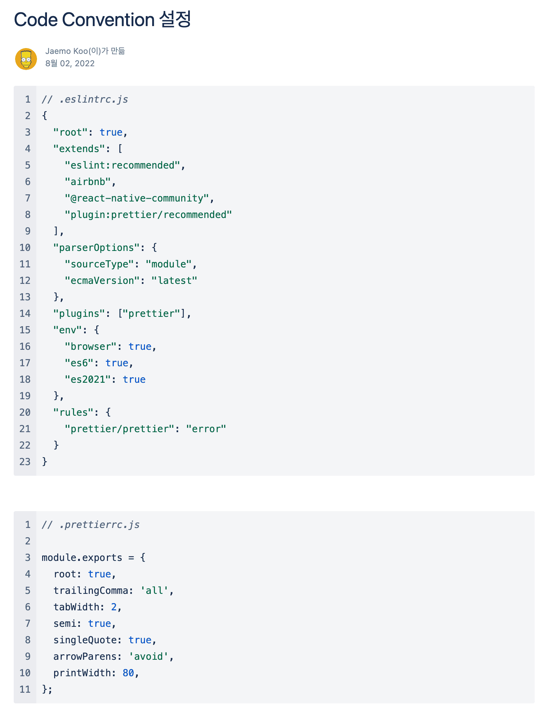
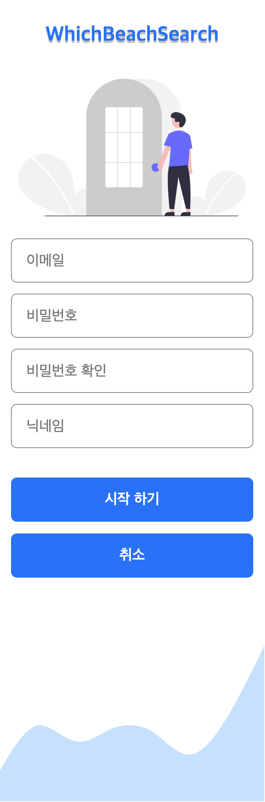
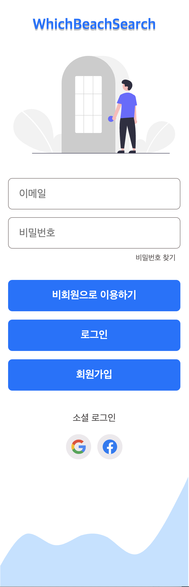

# WHICH BEACH SEARCH

## 🏖 국내 해수욕장 정보 조회 서비스

<br/>
<p align="center">


</p>  
<br/>

## 프로젝트 개요

- #### 휴가철에는 유명한 해수욕장의 몰려드는 인파의 문제, 해상 스포츠를 즐기는 사람에겐 파고와 같은 해상 날씨의 정보가 중요합니다.
- #### 사람도 몰리지 않고, 나는 몰랐던 숨은 보물 같은 해수욕장을 찾고 계신가요? <br/>해상 스포츠를 즐기기위해 해수욕장의 날씨와 해상 정보를 쉽고 빠르게 알고 싶으신가요?
- #### 이러한 불편함을 해결하고자 전국 모든 해수욕장에 대한 정보와 날씨, 해상 정보를 제공하는 서비스를 개발하기로 하였습니다.
<br/>

## 프로젝트 설계

### **Figma 🖌**

#### 1. 화면 와이어프레임 작성

#### 2. 실제 서비스 화면 디자인 적용

<br>
<p align="center">

</p>

<br/>
<br/>

### **v1.0.0 기능 리스트 정리**

<br>
<p align="center">

</p>

### **개발 환경 정의**

Code Convention & Commit Convention 설정 및 정의

<br>
<p align="center">


</p>

<br>

### **디렉토리 구조**

```
💾 root
┣ 📂 assets
┣ 📂 js
┣ 📂 css
┣ 📂 components
┗ 📂 pages
  ┣ 📂 bookmark
  ┣ 📂 join
  ┣ 📂 lignin
  ┣ 📂 main
  ┣ 📂 map
  ┗ 📂 mypage
```

|    폴더    |                                       내용                                        |
| :--------: | :-------------------------------------------------------------------------------: |
|   assets   |                            로고, 아이콘 assets 파일들                             |
|     js     |                  firebase 초기화, 에러 처리, 로딩화면 구현 파일                   |
|    css     |                              공통 스타일링 정의 파일                              |
| components |                       재사용성이 있는 UI 스타일링 정의 파일                       |
|   pages    | 각 화면들의 구현 코드가 있는 폴더<br>각 화면의 폴더에는 html, js, css 파일이 있음 |

<br>
<br>

## **Tech Stack 🛠**

<br>

|                                     HTML5                                     |                                    CSS                                     |                                    JavaScript                                    |                                       Firebase                                       |
| :---------------------------------------------------------------------------: | :------------------------------------------------------------------------: | :------------------------------------------------------------------------------: | :----------------------------------------------------------------------------------: |
|  |  |  |  |

<br>

|                                         GitHub                                         |                                         GitHub-Desktop                                          |                                      GitFlow                                       |
| :------------------------------------------------------------------------------------: | :---------------------------------------------------------------------------------------------: | :--------------------------------------------------------------------------------: |
|  |  |  |

<br>

|                                     Jira                                     |                                        Confluence                                        |
| :--------------------------------------------------------------------------: | :--------------------------------------------------------------------------------------: |
|  |  |

<br>
<br>

## 기능 구현 화면

### 1. 회원가입 화면

- 이메일 & 비밀번호 회원 가입
- 비밀번호와 비밀번호 확인 값 데이터 일치해야 가입 진행
- 이메일 형식과 비밀번호에 대한 데이터 유효성 검증
<p align="center">
 
 </p>

<br>

### 2. 로그인 화면

- 서비스에 대해 회원가입 하지 않고, 먼저 사용해보시길 원하는 분들을 위한 비회원으로 로그인 기능
- 이메일 & 비밀번호 로그인 또는 구글, 페이스북 소셜로그인 방식
- 비밀번호 찾기 기능
<p align="center">
 
 </p>

<br>

### 3.1 메인 화면

- 해당 해수욕장의 12시간 날씨 및 주간 날씨 제공
- 해당 해수욕장의 오늘 일출, 일몰 시간 정보
- 해수욕장 둘러보기 (3D 파노라마 뷰 사이트로 이동)
- 해수욕장 정보 (해수욕장 정보가 있는 사이트로 이동)
- 지도에서 보기 (해수욕장 위치 지도상에서 표시)
<p align="center">
   
   </p>

<br>

### 3.2 메인화면 - 검색

- 검색 자동 완성 기능 구현
<p align="center">
   
   </p>

<br>

### 4. 북마크 화면

- 해수욕장 즐겨찾기 기능
- 즐겨찾기에서 해수욕장 클릭 시 해수욕장 메인 화면으로 이동
- 비회원의 경우 북마크 화면 진입 시 로그인 여부 확인
<p align="center">
   
   </p>

<br>

### 5. 지도 화면

- 해수욕장 검색 기능
- 지도에 해수욕장 위치에 마커 표시
- 마커 선택 후 상세보기 클릭 시 메인 화면으로 이동
<p align="center">
   
   </p>

<br>

### 6. 더보기 화면

- 비밀번호 변경 기능
- 로그아웃 기능
<p align="center">
   
   </p>

<br>
<br>

## 👨🏻‍💻 프로젝트 마무리
<br>

## [Blog - WhichBeachSarch 프로젝트 회고](https://velog.io/@goodjam92/Which-Beach-Search-회고)
